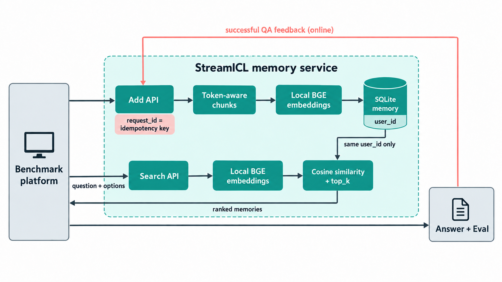

# StreamICL-inspired Text Memory API

This repository contains a text-only Add/Search memory service for Agent Memory Leaderboard. It is inspired by StreamICL, but it is not a reproduction of the original algorithm. The evaluation platform owns answer generation and scoring; this service only stores and retrieves memory.

## Method



- Add splits source messages at the local model's token limit. Positive-score Streaming QA feedback is stored as a question-answer example; nonpositive feedback is acknowledged but not indexed.
- `BAAI/bge-small-en-v1.5` runs locally on CPU. Neither Add text nor Search queries go to an embedding API.
- SQLite stores text, unit-normalized vectors, and Add request IDs. Search ranks all memories belonging to the exact `user_id` by cosine similarity and returns at most the requested `top_k`. Multiple-choice `options`, when present, are included in the embedding query.
- Add is synchronous: HTTP 200 is returned only after embeddings and SQLite writes complete. Repeating an identical `request_id` is idempotent; reusing one for a different payload returns HTTP 409.

Compared with the original StreamICL baseline, this implementation uses SQLite and an in-process scan instead of FAISS, message chunks and positive-feedback examples instead of question-keyed full trajectories, and caller-provided `top_k` instead of a fixed top four. It does not assemble prompts or call an answer LLM.

## Run locally

Requires Python 3.10 or newer. From the repository root in PowerShell:

```powershell
python -m venv .venv
.\.venv\Scripts\python -m pip install -r requirements.txt
.\.venv\Scripts\python -c "from huggingface_hub import snapshot_download; snapshot_download(repo_id='BAAI/bge-small-en-v1.5', local_dir='models/bge-small-en-v1.5', ignore_patterns=['*.bin', 'onnx/*', 'openvino/*'])"
Copy-Item .env.example .env.local
.\.venv\Scripts\python -c "import secrets; print(secrets.token_hex(32))"
```

Put the generated secret in `.env.local` as `PARTICIPANT_MEMORY_API_KEY`, then run:

```powershell
.\start.ps1
```

The service listens on `http://127.0.0.1:8094`. The startup script does not create a public tunnel. Keep the API key private. Use a new SQLite database when switching embedding models; vectors from the previous Qwen model cannot be mixed with local BGE vectors.

## Deploy on Ubuntu 22.04

The following commands assume the `ubuntu` user and `/home/ubuntu/StreamICL`. The application listens only on localhost; Caddy provides public HTTPS.

```bash
sudo apt update
sudo apt install -y git python3-venv python3-pip curl
git clone https://github.com/solomoon313/StreamICL.git
cd StreamICL
python3 -m venv .venv
.venv/bin/pip install --upgrade pip
.venv/bin/pip install torch --index-url https://download.pytorch.org/whl/cpu
.venv/bin/pip install -r requirements.txt
.venv/bin/python -c "from huggingface_hub import snapshot_download; snapshot_download(repo_id='BAAI/bge-small-en-v1.5', local_dir='models/bge-small-en-v1.5', ignore_patterns=['*.bin', 'onnx/*', 'openvino/*'])"
cp .env.example .env.local
.venv/bin/python -c 'import secrets; print(secrets.token_hex(32))'
nano .env.local
chmod 600 .env.local
```

Replace `PARTICIPANT_MEMORY_API_KEY` with the generated secret. Keep the model and database paths from the example. Never paste the secret into a screenshot, issue, or Git commit. The service loads the model only from disk after it is downloaded. See [Hugging Face's download documentation](https://huggingface.co/docs/huggingface_hub/guides/download).

Install and start the persistent service:

```bash
sudo cp deploy/streamicl.service /etc/systemd/system/streamicl.service
sudo systemctl daemon-reload
sudo systemctl enable --now streamicl
sudo systemctl status streamicl --no-pager
curl http://127.0.0.1:8094/health
```

On failure, inspect `sudo journalctl -u streamicl -n 80 --no-pager`.

In Cloudflare DNS, create an `A` record named `memory` pointing to the server public IPv4, with proxy status **DNS only**. In the Tencent Cloud instance firewall, allow inbound TCP 80 and 443. Do not open port 8094 publicly. Install Caddy using its [official Ubuntu instructions](https://caddyserver.com/docs/install), then:

```bash
sudo cp deploy/Caddyfile /etc/caddy/Caddyfile
sudo caddy validate --config /etc/caddy/Caddyfile
sudo systemctl reload caddy
curl https://memory.848496.xyz/health
```

Caddy obtains and renews the HTTPS certificate automatically once DNS and ports 80/443 work.

## API

`GET /health` requires no authentication. Add and Search require `Authorization: Bearer <PARTICIPANT_MEMORY_API_KEY>`; `Authorization: Token` and `X-API-Key` are also accepted.

```text
POST /v1/memories/add
POST /v1/memories/search
```

Add requires `request_id`, `messages` (`role`, nonempty string `content`, optional Unix-millisecond `timestamp`), `user_id`, and `session_id`. Search requires `query`, `user_id`, and `top_k`; `options` is an optional top-level string array for multiple-choice questions. Search returns `{"data": [...]}` in relevance order, or `{"data": []}`. Only text content is supported.

## Test and data retention

```powershell
.\.venv\Scripts\python -m pip install pytest
.\.venv\Scripts\python -m pytest tests -q
```

The SQLite database defaults to `participant_text_memory/data/bge_memory.db` with the example configuration and is ignored by Git. Do not log or publish evaluation payloads or keys. Delete evaluation data within 30 days after a run unless the platform grants written permission to retain it longer. This implementation has not been load-tested for a full public evaluation.

## Attribution

The StreamICL idea comes from Cheng-Kuang Wu, Zhi Rui Tam, Chieh-Yen Lin, Yun-Nung Chen, and Hung-yi Lee, [*StreamBench: Towards Benchmarking Continuous Improvement of Language Agents*](https://papers.nips.cc/paper_files/paper/2024/hash/c189915371c4474fe9789be3728113fc-Abstract-Datasets_and_Benchmarks_Track.html), with [source code](https://github.com/stream-bench/stream-bench). This service also draws on the [AgentMemoryBench streamICL baseline](https://github.com/solomoon313/AgentMemoryBench). The API service here was written separately and differs in the ways listed above.
